# Architecture Diagram (Task 7) — Data Flow, Versioning Points, Ownership Boundaries

> Goal: show end-to-end flow from **sources → SQLite/manifest artifacts → API response**, with explicit **versioning/immutability points** and **DS vs ML Ops ownership boundaries**.

## Mermaid diagram (GitHub-renderable)

```mermaid
flowchart LR
  %% =========================
  %% SOURCES
  %% =========================
  subgraph S["Data Sources"]
    BND["Boundary GeoJSON<br/>sample_boundary.geojson"]
    HERD["Herd Config JSON<br/>sample_herds_pasturemap.json"]
    REF["Reference DB (SQLite)<br/>pasture_reference.db<br/>RAP + gSSURGO"]
    OM["Open-Meteo API<br/>daily weather"]
  end

  %% =========================
  %% INGESTION (CLI)
  %% =========================
  subgraph ING["Ingestion Pipeline (CLI: ingest)"]
    I1["Parse/Normalize Boundary<br/>load_boundary_geojson"]
    I2["Upsert Geographic Boundary<br/>geographic_boundaries"]
    I3["Upsert Herd Configs<br/>herd_configurations"]
    I4["Fetch + Upsert Weather<br/>weather_forecasts"]
    I5["Materialize Features (daily)<br/>boundary_daily_features"]
    I6["DQ checks + run record<br/>ingestion_runs + dq_checks"]
  end

  %% =========================
  %% STORAGE (DB + IMMUTABLE ARTIFACTS)
  %% =========================
  subgraph ST["Storage"]
    DB["SQLite DB<br/>(idempotent upserts + append-only facts)"]
    MF["Immutable Manifest Files<br/>out/manifests/{boundary}/{asof}_{snapshot}.json"]
  end

  %% =========================
  %% COMPUTE (CLI)
  %% =========================
  subgraph CMP["Compute Recommendation (CLI: compute)"]
    C1["Load inputs<br/>boundary + herd + features_row"]
    C2["Compute logic<br/>days_remaining:vN"]
    C3["Create Run Manifest<br/>snapshot_id = sha256(stable_json)"]
    C4["Append-only write<br/>grazing_recommendations"]
    C5["Drift guard<br/>refuse overwrite on provenance mismatch"]
  end

  %% =========================
  %% EXPLAIN / API
  %% =========================
  subgraph EXP["Explain / API Response"]
    E1["Explain (CLI: explain)<br/>reads DB + manifest"]
    API["Serve (FastAPI)<br/>returns reco + provenance + explanation"]
  end

  %% =========================
  %% VERSIONING CONTROL PLANE
  %% =========================
  subgraph VER["Versioning Control Plane"]
    MV["model_versions table"]
    LV["logic_version<br/>days_remaining:vN"]
    CH["config_hash<br/>sha256(ds_params + thresholds)"]
    DSNAP["data_snapshot_versions<br/>RAP/gSSURGO/weather versions"]
    SID["snapshot_id<br/>manifest hash"]
  end

  %% =========================
  %% OWNERSHIP BOUNDARIES
  %% =========================
  subgraph OWN["Ownership Boundaries"]
    direction TB
    DS["Data Science owns:<br/>• model logic modules<br/>• parameters + validation thresholds<br/>• logic_version bump policy"]
    MLOPS["ML Ops owns:<br/>• infra + deploy artifacts<br/>• monitoring + alerts<br/>• versioning enforcement + storage<br/>• rollbacks + incident response"]
  end

  %% =========================
  %% WIRING
  %% =========================
  BND --> I1 --> I2 --> DB
  HERD --> I3 --> DB
  OM --> I4 --> DB
  REF --> I5 --> DB
  I2 --> I5
  I4 --> I5
  I5 --> I6 --> DB

  DB --> C1 --> C2 --> C3 --> MF
  C3 --> SID
  C2 --> LV
  C3 --> DSNAP
  C3 --> CH
  C1 --> C4 --> DB
  C1 --> C5 --> DB

  DB --> E1 --> API
  MF --> E1

  LV --> MV
  CH --> MV
```

## What the diagram is *asserting* (the important bits)

### 1) Clean separation of DS vs ML Ops responsibilities

## **Data Science (DS)**

- Owns the *decision logic* (e.g., `src/grc_pipeline/logic/days_remaining.py`).
- Owns *parameters + validation thresholds* (e.g., min/max days, freshness windows, monitoring thresholds) that define “correct/acceptable.”
- Owns the policy for when to bump `logic_version` (e.g., `days_remaining:v1 → v2`).

## **ML Ops**

- Owns *deployment artifacts* (container image / package build), infra, scheduling, and runtime configuration wiring.
- Owns *monitoring/alerting* execution and operational response.
- Owns *versioning enforcement* (immutability, append-only history, storage policies for manifests).

### 2) Explicit versioning points (where “history” becomes immutable)

- **`logic_version`**: a DS-controlled semantic version string that identifies logic behavior.
- **`config_hash`**: derived hash of parameters/thresholds that affect computation (prevents silent changes).
- **`data_snapshot_versions`**: identifies the data source versions used (RAP/gSSURGO/weather).
- **`snapshot_id` + manifest file**: immutable snapshot of inputs/outputs + provenance (replayable months later).
- **Append-only DB insert**: `grazing_recommendations` is never overwritten; conflicts are ignored.
- **Drift guard**: if the same (boundary, herd, date, logic_version, config_hash) would produce different provenance, the compute refuses.

### 3) How this reaches an API response

- API (or CLI `explain`) reads the **recommendation row + manifest pointer**.
- It reconstructs a human explanation from the stored snapshot (formula + substitutions + “derived_from” provenance).
- The response can include:
  - outputs (days remaining, recommended move date),
  - provenance (logic/config/data snapshot/code version),
  - and detailed derivations (RAP composite date, biomass/ha, boundary area, herd intake).
