# Part 2 — Data Flow Diagram (Credit Verification)

> This is a **Mermaid** diagram to keep the repo self-contained. Render it in GitHub or any Mermaid viewer.

```mermaid
flowchart LR
  %% =========================
  %% SOURCES
  %% =========================
  subgraph S["Sources"]
    PM["PastureMap<br/>(paddocks, herd moves, notes, photos)"]
    SF["Salesforce<br/>(enrollment, protocol, check-ins, case state)"]
    LAB["Soil Lab APIs<br/>(results, chain-of-custody, sample points)"]
    HW["Hardware Feeds<br/>(Ranchbot/Halter/etc)"]
    DOCS["GMP / LSA PDFs<br/>(uploaded docs)"]
  end

  %% =========================
  %% INGESTION + SNAPSHOTS
  %% =========================
  subgraph ING["Ingestion<br/>(Connectors + Snapshotting — Ops-owned)"]
    C1["Connector Jobs<br/>(auth, pull, paginate)"]
    RAW["Raw Snapshot Store<br/>(object storage)"]
    META["Snapshot Index DB<br/>(metadata + hashes)"]
  end

  %% =========================
  %% NORMALIZATION
  %% =========================
  subgraph NORM["Normalization + Claim Extraction"]
    N1["Parse + Normalize<br/>(ids, timestamps, geometries)"]
    EVID["Evidence Items<br/>(doc/event/lab-result)"]
    CLAIMS["Claims<br/>(machine-checkable assertions)"]
    RECON["Geo Reconciliation<br/>LSA parcels vs PM paddocks<br/>+ sampling points coverage"]
  end

  %% =========================
  %% VERIFICATION ENGINE
  %% =========================
  subgraph VER["Verification Engine<br/>(policy-as-code)"]
    GATES["Completeness Gates<br/>NOT_READY / NEEDS_REVIEW"]
    POLICY["Policy Eval<br/>Good/Better/Best<br/>(policy_version)"]
    OUTREC["Ranch Verification Record<br/>(status + tier + metrics)"]
    PACK["Evidence Pack<br/>(manifest + report<br/>hashes + pointers)"]
  end

  %% =========================
  %% HUMAN REVIEW
  %% =========================
  subgraph HITL["Human Review<br/>(MRV workbench)"]
    UI["Reviewer UI<br/>queue + case view"]
    DEC["Approve / Request Info / Override<br/>(reason + notes + attachments)"]
    AUDIT["Immutable Audit Log<br/>(append-only)"]
  end

  %% =========================
  %% OUTPUTS
  %% =========================
  subgraph OUT["Outputs"]
    ISS["Credit Issuance System<br/>(consumes APPROVED_LOCKED records)"]
    API["Verification API<br/>(read-only queries)"]
  end

  %% =========================
  %% FLOWS
  %% =========================
  PM --> C1
  SF --> C1
  LAB --> C1
  HW --> C1
  DOCS --> C1

  C1 --> RAW
  C1 --> META

  RAW --> N1
  META --> N1

  N1 --> EVID
  N1 --> CLAIMS
  N1 --> RECON
  RECON --> CLAIMS

  CLAIMS --> GATES
  EVID --> GATES
  GATES --> POLICY
  POLICY --> OUTREC
  POLICY --> PACK

  OUTREC --> UI
  PACK --> UI
  UI --> DEC
  DEC --> AUDIT
  DEC --> OUTREC

  OUTREC --> API
  OUTREC --> ISS

  %% =========================
  %% STYLING / OWNERSHIP ANNOTATIONS
  %% =========================
  classDef ops fill:#f3f4f6,stroke:#111827,stroke-width:1px;
  classDef ds fill:#ecfeff,stroke:#0f766e,stroke-width:1px;
  classDef audit fill:#fff7ed,stroke:#9a3412,stroke-width:1px;

  class C1,RAW,META ops;
  class N1,EVID,CLAIMS,RECON,POLICY,GATES,OUTREC,PACK ds;
  class UI,DEC,AUDIT audit;
```

## Versioning points (what gets pinned in every record)

- `policy_version` + policy hash
- per-source `snapshot_id` + snapshot hash
- connector build versions
- geo reconciliation algorithm version
- evidence pack manifest hash

These are what allow “replay the decision” under audit: load the same snapshots + the same policy.
